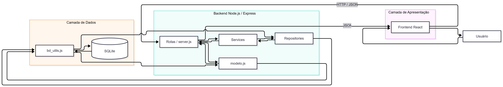

# Arquitetura do ESM Forum

## 1. Identificação da Arquitetura Atual

O ESM Forum possui uma arquitetura simples baseada na separação entre frontend, backend e banco de dados.

O sistema pode ser caracterizado principalmente como uma arquitetura **cliente-servidor**, na qual o frontend React funciona como cliente e se comunica com o backend Node.js/Express por meio de requisições HTTP.

O backend funciona como servidor da aplicação e é responsável por receber as requisições, executar as operações necessárias e retornar os dados em formato JSON.

Além disso, o sistema apresenta uma separação parcial em camadas, principalmente após a implementação da funcionalidade de busca.

---

## 2. Camada de Apresentação

A camada de apresentação é formada principalmente pelo frontend React.

Exemplos de arquivos:

```text
esmforum-react/src/pages/Pergunta.js
esmforum-react/src/pages/Resposta.js
```

Essa camada é responsável por:

- exibir as perguntas e respostas;
- receber entradas do usuário;
- enviar requisições ao backend;
- exibir os dados retornados pela API;
- atualizar a interface após operações realizadas.

Na funcionalidade de busca, por exemplo, o frontend envia uma requisição para:

```text
GET /perguntas/busca?termo=palavra
```

e atualiza a lista exibida na tela com o resultado recebido.

---

## 3. Camada de Aplicação e Negócio

No backend, a lógica está distribuída entre diferentes módulos.

O arquivo `server.js` é responsável pela configuração principal da aplicação Express e pelo registro das rotas.

Parte das operações existentes ainda utiliza diretamente o módulo:

```text
modelo.js
```

Esse arquivo contém funções relacionadas às perguntas e respostas, como:

```text
listar_perguntas()
cadastrar_pergunta()
cadastrar_resposta()
get_pergunta()
get_respostas()
```

Na funcionalidade de busca, foi criada uma separação mais clara:

```text
routes/buscaPerguntas.js
services/buscaPerguntasService.js
services/estrategiaBuscaTexto.js
```

A rota recebe a requisição HTTP e delega a operação ao serviço.

O serviço executa a regra de busca e utiliza uma estratégia para determinar se uma pergunta corresponde ao termo pesquisado.

---

## 4. Camada de Dados

A camada de dados é responsável pela comunicação com o banco SQLite.

O projeto utiliza:

```text
bd/bd_utils.js
```

para executar consultas e operações no banco.

Parte do sistema utiliza esse módulo por meio de `modelo.js`.

Na funcionalidade de busca também foi criado:

```text
repositories/perguntaRepository.js
```

Esse repository centraliza a consulta às perguntas utilizada pelo serviço de busca.

Essa organização reduz a dependência direta entre a lógica da aplicação e o acesso ao banco de dados.

---

## 5. Comunicação entre Frontend e Backend

O frontend React e o backend Express se comunicam utilizando HTTP.

O frontend envia requisições para o backend executado em:

```text
http://localhost:5000
```

O frontend é executado em:

```text
http://localhost:3000
```

Os dados são enviados e recebidos em formato JSON.

Exemplo de fluxo de busca:

1. O usuário informa uma palavra no campo de busca.
2. O frontend envia uma requisição HTTP ao backend.
3. A rota de busca recebe o termo informado.
4. O serviço de busca executa a regra da funcionalidade.
5. O repository consulta os dados necessários.
6. O banco SQLite retorna as perguntas.
7. O serviço filtra os resultados.
8. O backend retorna os dados em JSON.
9. O frontend atualiza a tabela exibida ao usuário.

---

## 6. Avaliação da Estrutura Atual

A arquitetura atual é adequada para o tamanho do projeto e permite entender facilmente o fluxo principal da aplicação.

Entretanto, a separação em camadas ainda não é aplicada de maneira uniforme.

As funcionalidades originais continuam concentradas principalmente em `server.js` e `modelo.js`, enquanto a funcionalidade de busca já utiliza uma organização separada entre rota, serviço e repository.

Essa diferença mostra uma oportunidade de evoluir o restante do projeto para uma estrutura mais consistente.

---

## 7. Diagrama Arquitetural

O diagrama abaixo representa os principais componentes e o fluxo de dados do sistema.

