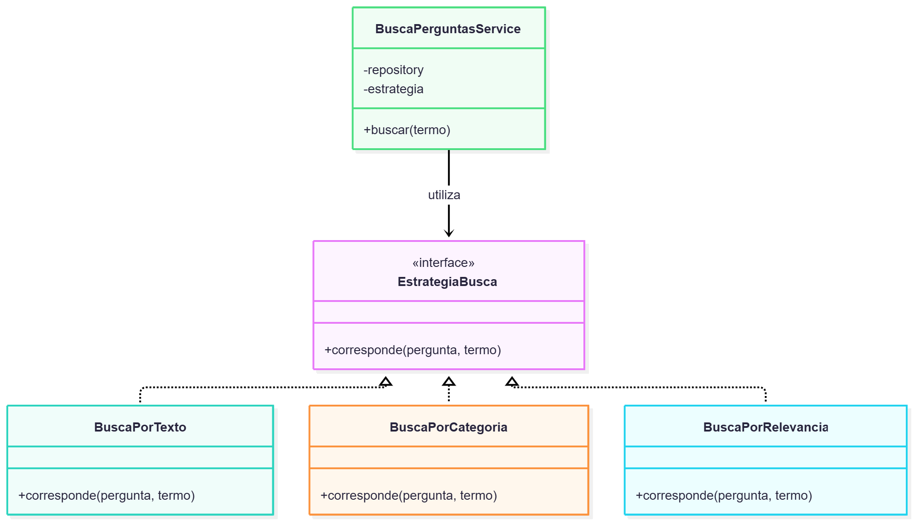
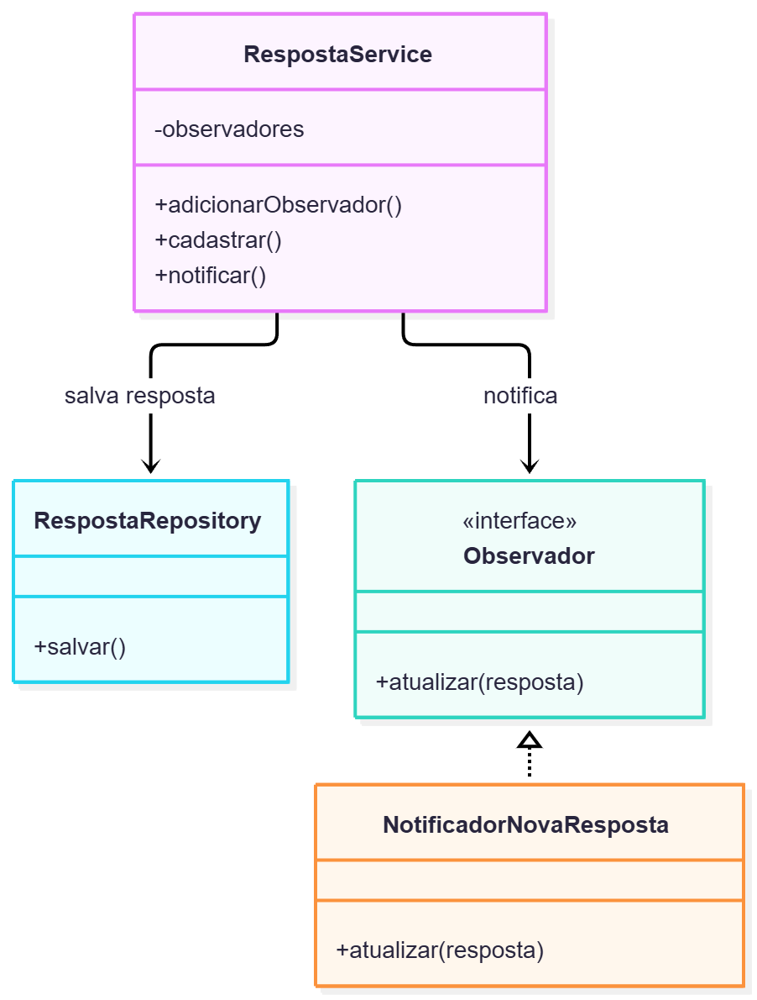
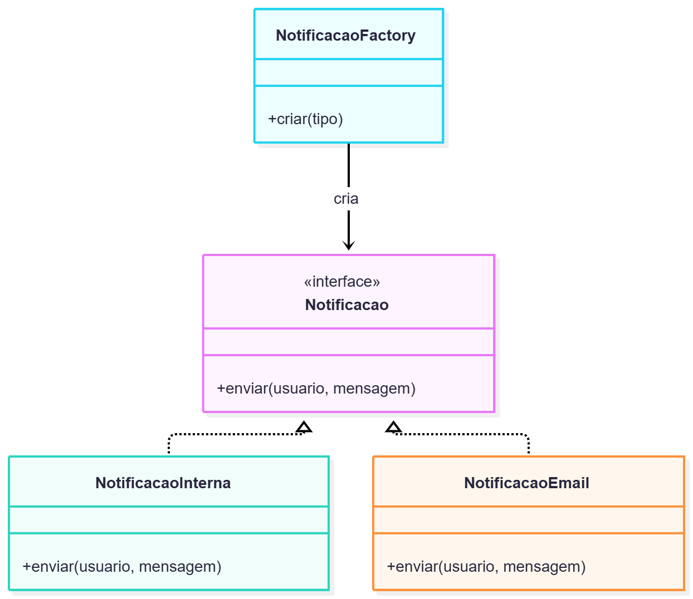

# Padrões de Projeto Propostos

## Introdução

Para permitir a evolução do ESM Forum sem concentrar novas responsabilidades nos módulos atuais, foram escolhidos três padrões de projeto que podem ser aplicados às funcionalidades propostas para o sistema:

- Strategy
- Observer
- Factory

Os padrões foram escolhidos considerando problemas reais das funcionalidades planejadas e buscando facilitar manutenção e futuras extensões.

---

# 1. Strategy

## Funcionalidade

Busca de perguntas.

## Contexto e justificativa

A busca inicialmente implementada compara o termo informado pelo usuário com o texto das perguntas.

Com a evolução do sistema, outras formas de busca podem ser necessárias, como:

- busca por texto;
- busca por categoria;
- busca por relevância;
- busca por múltiplas palavras.

Se todas essas regras fossem colocadas diretamente dentro do serviço de busca, ele precisaria ser alterado sempre que uma nova forma de pesquisa fosse criada.

O padrão **Strategy** permite separar cada algoritmo de busca em uma estratégia independente.

## Proposta de solução

Seria definida uma interface conceitual chamada `EstrategiaBusca`, responsável por estabelecer a operação `corresponde()`.

Cada forma de busca teria uma implementação própria:

- `BuscaPorTexto`
- `BuscaPorCategoria`
- `BuscaPorRelevancia`

O `BuscaPerguntasService` receberia uma estratégia e utilizaria essa implementação sem precisar conhecer os detalhes do algoritmo.

## Exemplo de código

```javascript
class BuscaPorTexto {
  corresponde(pergunta, termo) {
    return pergunta.texto
      .toLowerCase()
      .includes(termo.toLowerCase());
  }
}

class BuscaPorCategoria {
  corresponde(pergunta, termo) {
    return pergunta.categoria
      .toLowerCase()
      .includes(termo.toLowerCase());
  }
}

class BuscaPerguntasService {
  constructor(repository, estrategia) {
    this.repository = repository;
    this.estrategia = estrategia;
  }

  buscar(termo) {
    const perguntas = this.repository.listar();

    return perguntas.filter(pergunta =>
      this.estrategia.corresponde(pergunta, termo)
    );
  }
}
```

Com essa estrutura, uma nova estratégia pode ser adicionada sem modificar a lógica principal do serviço.

## Diagrama



---

# 2. Observer

## Funcionalidade

Notificação de novas respostas.

## Contexto e justificativa

Uma das funcionalidades previstas para o ESM Forum é notificar o autor de uma pergunta quando uma nova resposta for cadastrada.

Sem um padrão específico, o código responsável por cadastrar a resposta poderia também ficar responsável por criar e enviar notificações.

Isso aumentaria o acoplamento entre funcionalidades diferentes.

O padrão **Observer** é adequado porque permite que objetos interessados sejam avisados automaticamente quando determinado evento ocorre.

## Proposta de solução

O serviço responsável por cadastrar respostas funcionaria como o objeto observado.

Quando uma nova resposta fosse registrada, ele notificaria os observadores cadastrados.

Um possível observador seria:

`NotificadorNovaResposta`

Esse componente receberia os dados da pergunta e da resposta e criaria uma notificação para o autor da pergunta.

Outros observadores poderiam ser adicionados futuramente sem modificar o serviço principal.

## Exemplo de código

```javascript
class RespostaService {
  constructor(repository) {
    this.repository = repository;
    this.observadores = [];
  }

  adicionarObservador(observador) {
    this.observadores.push(observador);
  }

  cadastrar(idPergunta, texto) {
    const resposta = this.repository.salvar(
      idPergunta,
      texto
    );

    this.observadores.forEach(observador =>
      observador.atualizar(resposta)
    );

    return resposta;
  }
}
```

Um observador poderia ser:

```javascript
class NotificadorNovaResposta {
  atualizar(resposta) {
    console.log(
      `Nova resposta cadastrada na pergunta ${resposta.id_pergunta}`
    );
  }
}
```

Dessa forma, o cadastro de respostas continua responsável apenas pela operação principal, enquanto outros componentes reagem ao evento.

## Diagrama



---

# 3. Factory

## Funcionalidade

Criação de notificações.

## Contexto e justificativa

Com a evolução da funcionalidade de notificações, diferentes tipos de aviso podem ser criados.

Exemplos:

- notificação interna no sistema;
- notificação por e-mail;
- futuras notificações por outros canais.

Criar diretamente cada tipo de notificação dentro do serviço aumentaria a dependência entre a regra de negócio e as classes concretas.

O padrão **Factory** permite centralizar a criação desses objetos.

## Proposta de solução

Seria criada uma `NotificacaoFactory`.

Ela receberia o tipo de notificação desejado e seria responsável por criar o objeto correspondente.

As classes concretas poderiam ser:

- `NotificacaoInterna`
- `NotificacaoEmail`

O restante do sistema utilizaria a Factory sem precisar conhecer os detalhes de criação de cada classe.

## Exemplo de código

```javascript
class NotificacaoInterna {
  enviar(usuario, mensagem) {
    console.log(
      `Notificação interna para ${usuario}: ${mensagem}`
    );
  }
}

class NotificacaoEmail {
  enviar(usuario, mensagem) {
    console.log(
      `E-mail para ${usuario}: ${mensagem}`
    );
  }
}

class NotificacaoFactory {
  criar(tipo) {
    if (tipo === 'interna') {
      return new NotificacaoInterna();
    }

    if (tipo === 'email') {
      return new NotificacaoEmail();
    }

    throw new Error('Tipo de notificação inválido');
  }
}
```

O serviço poderia utilizar a Factory da seguinte forma:

```javascript
const factory = new NotificacaoFactory();

const notificacao = factory.criar('interna');

notificacao.enviar(
  usuario,
  'Sua pergunta recebeu uma nova resposta.'
);
```

Essa estrutura concentra a criação dos objetos e facilita a inclusão de novos tipos de notificação.

## Diagrama



---

# Conclusão

Os três padrões propostos atendem necessidades diferentes do ESM Forum.

O **Strategy** permite variar os algoritmos de busca sem alterar o serviço principal.

O **Observer** permite que outras funcionalidades reajam ao cadastro de uma resposta sem aumentar o acoplamento do serviço responsável por respostas.

O **Factory** centraliza a criação dos diferentes tipos de notificação e evita que os serviços precisem conhecer diretamente todas as implementações concretas.

Esses padrões tornam a estrutura do sistema mais preparada para extensão e manutenção à medida que novas funcionalidades forem adicionadas.