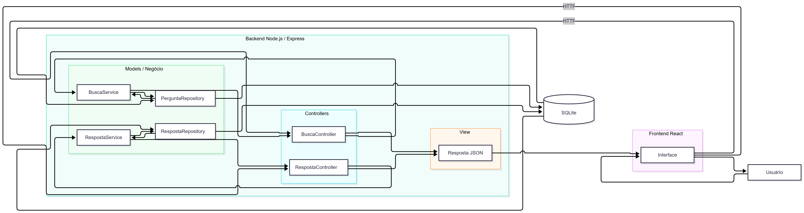

# Proposta de Organização Arquitetural

## Introdução

A estrutura atual do ESM Forum funciona bem para um projeto pequeno, mas parte das responsabilidades ainda está concentrada em arquivos como `server.js` e `modelo.js`.

A proposta é evoluir o backend para uma organização em camadas, separando apresentação, negócio e dados, além de aplicar o padrão MVC às principais funcionalidades.

Essa organização facilita manutenção, testes e futuras extensões do sistema.

---

# 1. Proposta de Separação em Camadas

## Camada de Apresentação

A camada de apresentação seria responsável por receber as requisições HTTP e devolver as respostas ao frontend.

Exemplos de módulos:

```text
routes/
  perguntasRoutes.js
  respostasRoutes.js
  buscaRoutes.js
```

Responsabilidades:

- definir os endpoints da API;
- receber parâmetros e dados enviados pelo cliente;
- encaminhar a operação para o controller ou service;
- devolver respostas JSON;
- definir códigos HTTP adequados.

Exemplo:

```javascript
router.get('/busca', buscaController.buscar);
```

A rota não deveria acessar diretamente o banco nem implementar regras de negócio.

---

## Camada de Negócio

A camada de negócio ficaria responsável pelas regras da aplicação.

Exemplos:

```text
services/
  perguntaService.js
  respostaService.js
  buscaPerguntasService.js
  estrategiaBuscaTexto.js
```

Responsabilidades:

- validar regras de negócio;
- coordenar operações;
- aplicar estratégias;
- decidir quais repositories devem ser utilizados;
- manter a lógica independente do protocolo HTTP.

Exemplo:

```javascript
function buscarPerguntas(termo) {
  const perguntas = repository.listar();

  return perguntas.filter(pergunta =>
    estrategia.corresponde(pergunta, termo)
  );
}
```

A camada de negócio não deveria conhecer detalhes de Express nem executar SQL diretamente.

---

## Camada de Dados

A camada de dados seria responsável exclusivamente pela persistência.

Exemplos:

```text
repositories/
  perguntaRepository.js
  respostaRepository.js
  usuarioRepository.js
```

Responsabilidades:

- executar consultas SQL;
- inserir e atualizar registros;
- consultar entidades;
- esconder os detalhes do banco das demais camadas.

Exemplo:

```javascript
function buscarPorId(id) {
  return bd.query(
    'SELECT * FROM perguntas WHERE id_pergunta = ?',
    [id]
  );
}
```

Dessa forma, services e controllers não precisariam conhecer diretamente a implementação utilizada pelo banco.

---

# 2. Comunicação entre as Camadas

O fluxo proposto seria:

```text
Frontend
   ↓
Route
   ↓
Controller
   ↓
Service
   ↓
Repository
   ↓
Banco SQLite
```

O retorno seguiria o caminho inverso:

```text
Banco SQLite
   ↓
Repository
   ↓
Service
   ↓
Controller
   ↓
JSON
   ↓
Frontend
```

Cada camada dependeria apenas da camada imediatamente abaixo ou de abstrações fornecidas por ela.

---

# 3. Proposta de Aplicação do MVC

O padrão MVC seria aplicado no backend separando:

- **Model**: dados e operações de persistência;
- **View**: respostas JSON enviadas pela API;
- **Controller**: controle do fluxo das requisições.

Neste projeto, como o frontend é separado em React, a View do backend seria representada principalmente pelas respostas JSON.

---

# 4. MVC na Funcionalidade de Busca

## Model

O Model seria representado pelos módulos relacionados aos dados das perguntas:

```text
repositories/perguntaRepository.js
```

Operações:

- listar perguntas;
- buscar perguntas;
- recuperar dados necessários para a busca.

## Controller

Seria criado:

```text
controllers/buscaController.js
```

Responsabilidades:

- receber o termo enviado na requisição;
- chamar o serviço de busca;
- devolver o resultado;
- tratar possíveis erros.

Exemplo:

```javascript
function criarBuscaController(buscaService) {
  return {
    buscar(req, res) {
      try {
        const termo = req.query.termo;

        const perguntas = buscaService.buscar(termo);

        res.json(perguntas);
      }
      catch (erro) {
        res.status(500).json({
          erro: erro.message
        });
      }
    }
  };
}
```

## View

A View seria a resposta JSON retornada ao frontend.

Exemplo:

```json
[
  {
    "id_pergunta": 1,
    "texto": "3+3",
    "num_respostas": 0
  }
]
```

---

# 5. MVC na Funcionalidade de Respostas

## Model

Seria criado um módulo:

```text
repositories/respostaRepository.js
```

Responsabilidades:

- cadastrar respostas;
- listar respostas de uma pergunta;
- consultar informações relacionadas às respostas.

Exemplo:

```javascript
function cadastrar(idPergunta, texto) {
  return bd.exec(
    'INSERT INTO respostas (id_pergunta, texto) VALUES (?, ?)',
    [idPergunta, texto]
  );
}
```

## Controller

Seria criado:

```text
controllers/respostaController.js
```

Responsabilidades:

- receber os dados enviados pelo usuário;
- chamar o serviço responsável;
- devolver o resultado da operação.

Exemplo:

```javascript
function criarRespostaController(respostaService) {
  return {
    cadastrar(req, res) {
      try {
        const { id_pergunta, resposta } = req.body;

        const resultado = respostaService.cadastrar(
          id_pergunta,
          resposta
        );

        res.json(resultado);
      }
      catch (erro) {
        res.status(500).json({
          erro: erro.message
        });
      }
    }
  };
}
```

## View

A View seria a resposta JSON enviada após o cadastro:

```json
{
  "id_resposta": 10
}
```

---

# 6. Exemplo de Fluxo Completo

Exemplo utilizando a busca de perguntas:

1. O usuário informa uma palavra no frontend React.
2. O frontend envia:

```text
GET /perguntas/busca?termo=javascript
```

3. A rota recebe a requisição.
4. A rota encaminha a operação ao `buscaController`.
5. O controller chama o `buscaPerguntasService`.
6. O service solicita os dados ao `perguntaRepository`.
7. O repository consulta o banco SQLite.
8. O banco retorna as perguntas.
9. O service aplica a estratégia de busca.
10. O controller recebe o resultado.
11. O backend devolve a resposta em JSON.
12. O frontend atualiza a lista exibida ao usuário.

---

# 7. Estrutura Proposta

Uma possível organização do backend seria:

```text
esmforum/
│
├── controllers/
│   ├── buscaController.js
│   ├── perguntaController.js
│   └── respostaController.js
│
├── routes/
│   ├── buscaRoutes.js
│   ├── perguntasRoutes.js
│   └── respostasRoutes.js
│
├── services/
│   ├── buscaPerguntasService.js
│   ├── perguntaService.js
│   ├── respostaService.js
│   └── estrategiaBuscaTexto.js
│
├── repositories/
│   ├── perguntaRepository.js
│   ├── respostaRepository.js
│   └── usuarioRepository.js
│
├── bd/
│   └── bd_utils.js
│
└── server.js
```

O `server.js` ficaria responsável apenas pela configuração principal da aplicação e pelo registro das rotas.

---

# 8. Diagrama MVC Proposto



---

# Conclusão

A proposta organiza o ESM Forum em camadas com responsabilidades mais claras.

A camada de apresentação fica responsável pela comunicação HTTP, a camada de negócio concentra as regras da aplicação e a camada de dados trata exclusivamente da persistência.

A aplicação do padrão MVC complementa essa organização ao separar Models, Controllers e Views.

Essa estrutura permite que o sistema cresça de forma mais organizada, reduz o acoplamento e facilita testes e manutenção.